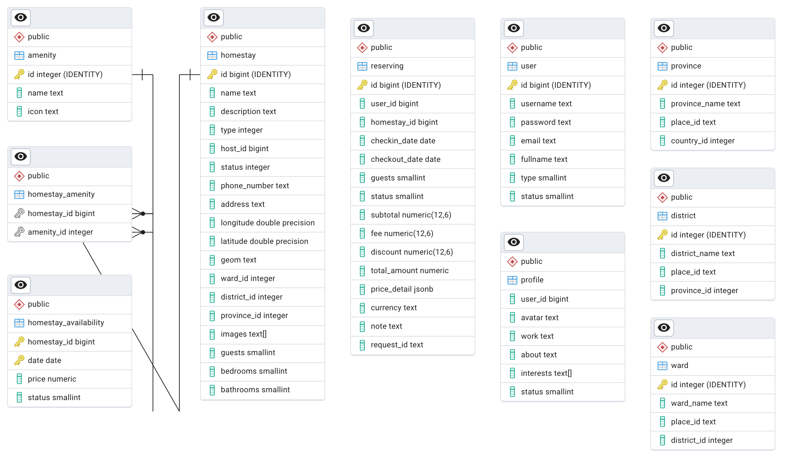

<!-- PROJECT LOGO -->
<br />
<div align="center">
  <a href="https://github.com/othneildrew/Best-README-Template">
    
  </a>

<h3 align="center">Homestay reservation API</h3>

  <p align="center">
    Back end api for homestay reservation system like Airbnb
  </p>
</div>

<!-- GETTING STARTED -->
## Introduction
### Description
* Developing a Homestay Booking System like Airbnb.
* A personal project for applying at  

### Techniques

* Data Modeling
* API Design
* Codebase: Principles, Design Patterns
* Database
* JPA/Hibernate
* Unit Testing
* Integration
* Security
* Deployment

### Tech stack

* Programming Language: Java 17
* Framework: Spring Boot 3.3.5
* Database: Postgres 17
* Unit Testing: JUnit 5
* CI/CD: Github Actions
* Deployment: AWS Elastic Beanstalk

### UML Diagram



### How to test
1. Install postgreSQL and pgAdmin 4
2. Run the schema script at sql/schema.sql to create database
3. Run the mock data to populate the database
4. See and test api endpoint using swagger at http://localhost:8080/swagger-ui/index.html or use Postman

### API cURL Sample
1. Get homestay by id
```bash
curl --location 'http://localhost:8080/api/v1/homestays/3'
```
2. Get homestays with pagination
```bash
curl --location 'http://localhost:8080/api/v1/homestays/pagination/2/5'
```
3. Search homestays by area with pagination
```bash
curl --location 'http://localhost:8080/api/v1/homestays?checkin_date=2024-11-20&checkout_date=2024-11-23&guests=2&page=1&page_size=5'
```
4. Reserve homestay
```bash
curl --location 'http://localhost:8080/api/v1/bookings' \
--header 'Content-Type: application/json' \
--data '{
    "request_id": "abc123",
    "user_id": 1,
    "homestay_id": 3,
    "checkin_date": "2024-11-20",
    "checkout_date": "2024-11-23",
    "guests": 2,
    "note": "I will have arrived by 2pm"
}'
```

Thank you so much! 🫶
